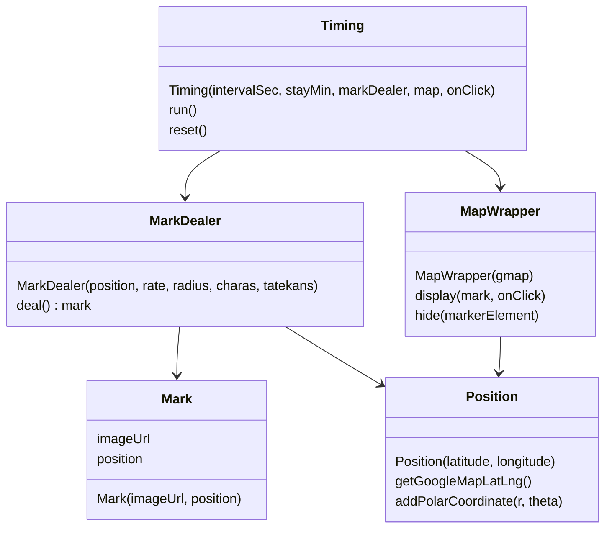

# Welcome to KyodaiGO

## クラスの説明

### Timing
- run() マークのライフサイクルを開始する。
- reset() マークのライフサイクルをリセットする。

＊マークのライフサイクルとは、「ランダムな時間後にマップ上のランダムな位置にランダムなマークを表示する。ランダムな時間後にそのマークを非表示する。以後このループを繰り返す」こと。

### MarkDealer
- deal() ランダムな画像と位置を持ったマークを生成する。

### MapWrapper
- display(mark, onClick) 受け取ったマークをマップ上に表示する。
- hide(markerElement) 受け取ったマークを非表示にする。

### Mark
マップ上に表示されるマーク

### Position
- getGoogleMapLatLng() 座標をGoogleMapsAPIで使える形式に変換する。
- addPolarCoordinate(r, theta) thetaの方角にrだけ離れた座標を取得する。